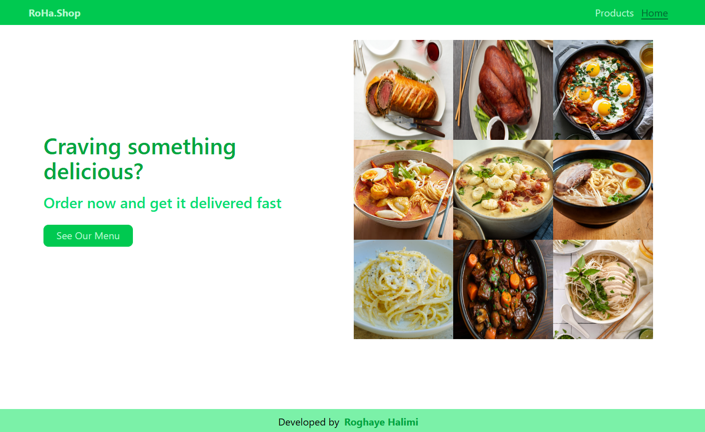
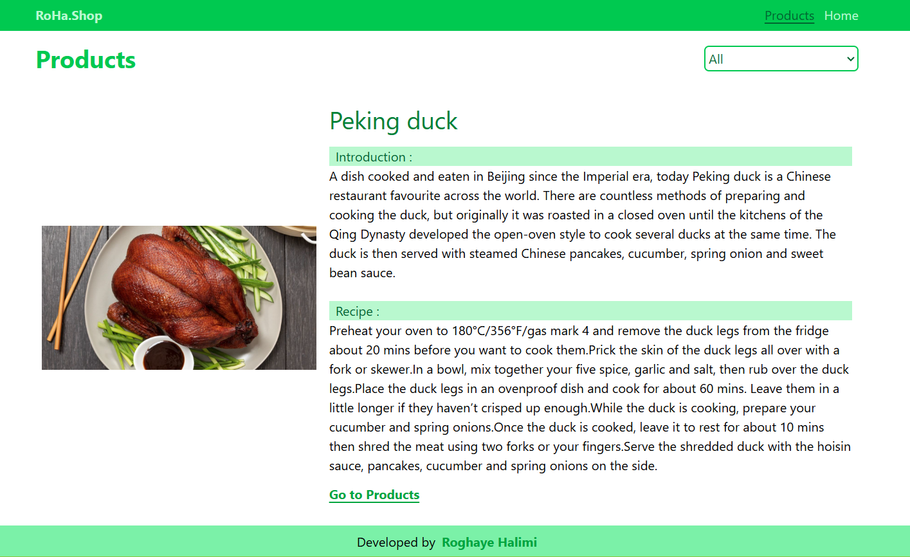

# 🍔 Rohashop - Assignment4

## 📌 Description
Rohashop is a modern food ordering web application built with React.
Users can browse meals, view details of each item, and place their orders through a clean and responsive interface.

## ✨ Features
- Browse available food items
- View detailed page for each meal
- Dynamic routing using URL parameters
- Smooth navigation between pages
- Responsive design (mobile-friendly)
- Clean UI built with Tailwind CSS

## 🛠 Tech Stack
- React
- React Router DOM
- useParams
- useNavigate
- Routes
- Link
- Tailwind CSS
- JavaScript (ES6+)

## ▶️ How to Run the Project
- Navigate to the Folder 
   cd countries-explorer
- Install dependencies
   npm install (i)
- Run the Project
   npm run dev 
   and open the localhost on your browser

## ScreenShots

